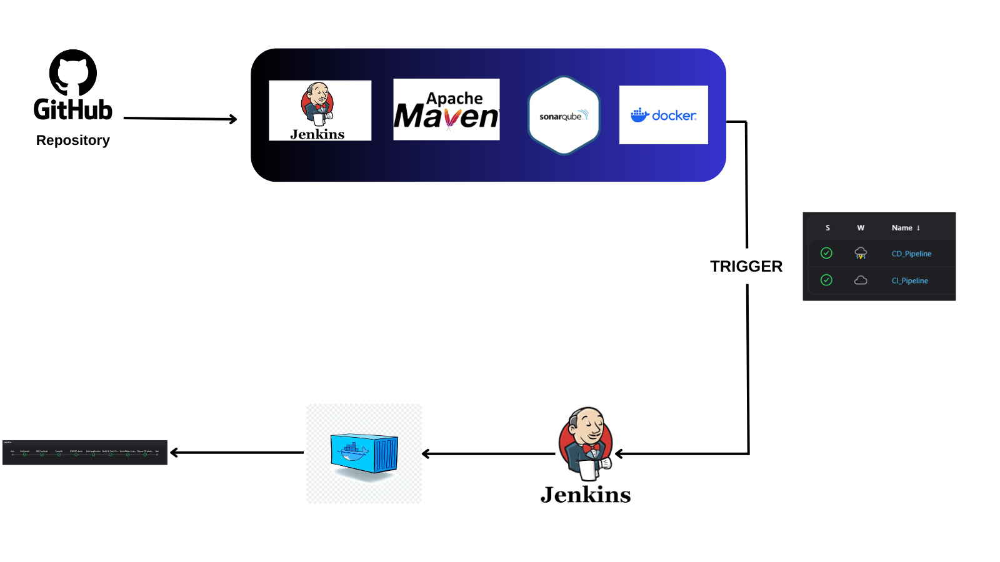

# CI/CD Pipeline Project

This repository contains a CI/CD pipeline implemented with Jenkins, integrating Maven, Docker, SonarQube, and OWASP Dependency Check. It showcases a complete workflow for building, testing, analyzing, and deploying a Java-based application.

## Overview

The Jenkins pipeline performs the following stages:
1. **Git Checkout**: Pulls the code from the GitHub repository.
2. **Compile**: Compiles the application using Maven.
3. **OWASP Check**: Performs dependency vulnerability scanning using OWASP Dependency Check.
4. **Build Application**: Packages the application.
5. **Build & Push Docker Image**: Builds a Docker image and pushes it to the Docker registry.
6. **SonarQube Analysis**: Executes SonarQube code analysis.
7. **Trigger CD Pipeline**: Initiates the Continuous Deployment pipeline.

## Technologies Used
- **Jenkins**: CI/CD automation
- **Maven**: Build automation
- **Docker**: Containerization
- **SonarQube**: Code quality analysis
- **OWASP Dependency Check**: Security vulnerability scanning

## Pipeline Diagram

Below is a visual representation of the CI/CD pipeline:



## Jenkinsfile

The pipeline is defined in the `Jenkinsfile` included in this repository. Below is a snippet of the pipeline configuration:

```groovy
pipeline {
    agent any

    tools {
        jdk 'jdk17'
        maven 'maven'
    }

    environment {
        SCANNER_HOME = tool 'sonar-scanner'
        SONAR_AUTH_TOKEN = 'your-sonarqube-token'
        SONAR_URL = 'http://your-sonarqube-url'
    }

    stages {
        stage('Git Checkout') {
            steps {
                git branch: 'main', changelog: false, poll: false, url: 'https://github.com/deepnix1/example-dockerfile.git'
            }
        }

        stage('Compile') {
            steps {
                sh 'mvn clean compile'
            }
        }

        stage('OWASP check') {
            steps {
                dependencyCheck additionalArguments: '--scan ./', odcInstallation: 'DP'
                dependencyCheckPublisher pattern: '**/dependency-check-report.xml'
            }
        }

        stage('Build application') {
            steps {
                sh 'mvn clean install'
            }
        }

        stage('Build & Push Docker Image') {
            steps {
                script {
                    withDockerRegistry(credentialsId: 'docker-credentials-id') {
                        sh "docker build -t shopping:latest -f docker/Dockerfile ."
                        sh "docker tag shopping:latest mustafadall1/shopping:latest"
                        sh "docker push mustafadall1/shopping:latest"
                    }
                }
            }
        }

        stage('SonarQube Analysis') {
            steps {
                withSonarQubeEnv('Sonarqube') {
                    sh '''
                    $SCANNER_HOME/bin/sonar-scanner \
                      -Dsonar.projectKey=jenkins-sonarqubee \
                      -Dsonar.projectName=jenkins-sonarqubee \
                      -Dsonar.host.url=$SONAR_URL \
                      -Dsonar.login=$SONAR_AUTH_TOKEN \
                      -Dsonar.java.binaries=target/classes
                    '''
                }
            }
        }

        stage('Trigger CD pipeline') {
            steps {
                script {
                    build job: "CD_Pipeline", wait: true
                }
            }
        }
    }
}
```

## Setup Instructions

1. **Jenkins Installation & Configuration:**
   - Install Jenkins along with required plugins (Pipeline, Docker, SonarQube, etc.).
   - Configure tools: JDK, Maven, and SonarQube Scanner.

2. **Credentials:**
   - Add credentials for Docker Hub and SonarQube in Jenkins.

3. **Webhook:**
   - Configure a GitHub webhook to automatically trigger the pipeline upon code pushes.

4. **Local Setup:**
   - Clone the repository.
   - Modify the necessary configuration parameters (e.g., SonarQube URL, tokens, etc.) in the `Jenkinsfile` or your Jenkins configuration.

## Repository Structure

```
├── Jenkinsfile
├── src/
├── pom.xml
├── Dockerfile
└── README.md
```

## Contact

## Contact

For further information or questions, feel free to reach out via [LinkedIn] (https://www.linkedin.com/in/mustafa-dall/).

